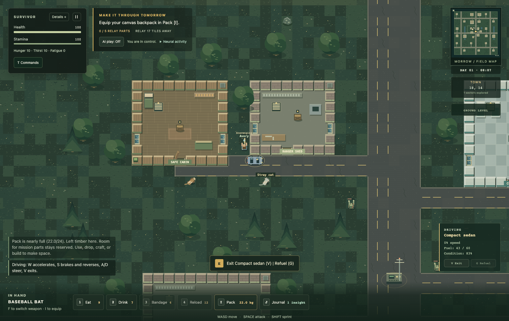
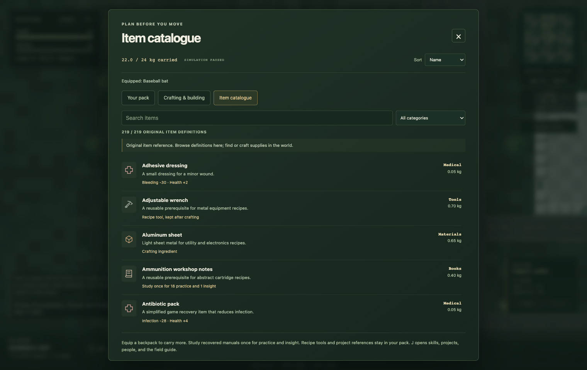
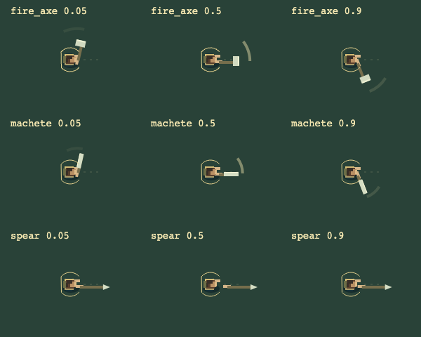

# After the Sirens

[](https://github.com/ChaseHendrick/After-the-Sirens/actions/workflows/ci.yml) [](LICENSE)

An original open world zombie survival game. Leave the town of Morrow, follow roads through farms, forests, riverside settlements, suburbs, and industrial districts, loot buildings, drive cars, and travel with other survivors.

[Play on Hendrick Research](https://www.hendrickresearch.com/games/after-the-sirens/) · [GitHub Pages mirror](https://chasehendrick.github.io/After-the-Sirens/) · [Download a release](https://github.com/ChaseHendrick/After-the-Sirens/releases) · [Item catalogue](CATALOGUE.md) · [Roadmap](ROADMAP.md)



**Version 0.4 is an early playable game.** It is inspired by the survival genre and built from original code, procedural visuals, world layouts, and synthesized sounds. The catalogue contains 219 original items and 65 recipes, with collectible ingredients clearly identified.

## Play

Open the demo above, or download `After-the-Sirens.html` from a release and open it in a desktop browser. The entire game is bundled in one file. Singleplayer needs no installation, account, server, external assets, or network connection. Multiplayer connects to a host running the included Node.js server on their own computer.

Choose **Open world** to explore and survive freely. The optional radio mission continues into free survival after completion. Choose **Rescue mission** for the compact original town scenario: find five radio parts, repair the relay, and survive until rescue arrives.

Chrome is tested. Other modern desktop browsers may work, but have not all been validated. Keyboard and mouse are required; mobile-sized layout checks do not establish touch play support.

Singleplayer autosaves every five seconds of play and on page exit. Continue restores the saved run. **Export save** keeps a portable JSON copy. Export regularly, especially when using local files, because browsers can restrict or clear local storage.



## Singleplayer, public worlds and private lobbies

Choose **Singleplayer** for an offline run, or **Multiplayer** to join a world hosted locally by you or a friend. Up to **20 connected players** share one seeded world with separate inventories, equipment, health, positions and appearance. Loot, terrain, cars, settlement supplies, research and factions are shared. The host server validates commands and saves world changes and survivor records to its own disk.

```sh
npm ci
npm run host
```

Open `http://localhost:8787` on the host computer. The terminal prints a private **SIRENS1 invite code**. Guests paste it under **Multiplayer → Public servers and private invites → Use invite**, then enter their name. Private worlds require the access key carried in that invite. Invites are secrets; browser preferences retain your name and address, not the world key. An invite link carries its key in a URL fragment which the game removes after reading it.

For a LAN public world:

```sh
npm run host -- --public --host 0.0.0.0 --name "Morrow Public" --seed 42
```

Guests use the host computer's LAN address, such as `ws://192.168.1.20:8787/game`, with an empty access key. Internet guests need a reachable address through port forwarding or a secure tunnel. The HTTPS website requires **wss://**; opening the game from the host's HTTP server permits local **ws://**. An invite does not provide NAT traversal.

**Browse public servers** reads the site's curated list, or another compatible directory address. A public host exposes its own `/servers` listing; private hosts return an empty list. The included optional directory service accepts authorized registration heartbeats and expires listings after three minutes. See [the complete hosting and directory guide](docs/MULTIPLAYER.md). The shipped curated list starts empty until real hosts are submitted. The website serves the game; it does not keep anyone's world server running.

This first multiplayer implementation supports the **ground floor and one shared loaded region**. Players who leave that region rejoin its anchor. Enemy decisions focus on the anchor survivor; guest contact damage is separately checked on the host. Upper floors, independent far-away regions, player-versus-player combat and public internet load testing remain future work. Twenty loopback protocol clients and two real browser players are tested separately.

## Chat, proximity voice and world commands

Press **T** or **Enter** during play to open chat and commands. **World** text chat reaches the server; **Nearby** reaches players within 20 tiles. Names and owner badges come from the host. Opening chat stops your controls while the multiplayer world continues. Messages are plain text, rate limited and bounded; nearby messages do not enter the shared world history.

In multiplayer, choose **Enable proximity voice**, grant microphone access, then hold **N** or the talk button to transmit. Nearby voices become quieter with distance. Mute, deafen and turn-off controls are available. Joining does not request microphone access. Voice uses direct WebRTC audio between consenting nearby players; the local host handles signaling and does not record audio. Microphone access needs localhost or HTTPS. Plain HTTP LAN guest addresses need a secure setup; voice across different networks may need a shared VPN. No external voice relay is configured.

Type **/help** for available commands. Singleplayer includes `/save`, `/time 18`, `/weather rain`, `/difficulty hard`, `/give me machete 1`, `/heal`, `/where`, `/items machete` and `/tp me X Y`. Teleports use global tile coordinates and require clear ground inside the loaded region. Item commands respect pack and stack limits. These are optional world controls, rather than supplies granted by the item catalogue.

The multiplayer terminal prints a separate **owner key**. Enter it under **World owner access** when joining to enable world controls and `/kick`, `/ban`, `/unban`, `/bans` and `/announce`. The first connected player is a simulation anchor; owner powers require this key. Guest invites and saved client preferences exclude it. Set `SIRENS_OWNER_TOKEN` to keep the owner key across restarts. Identity bans survive host restarts; they are not account or IP bans. See [hosting, voice setup and the complete command reference](docs/MULTIPLAYER.md).

## AI play and its local neural controller

Click **AI play** to watch the survivor scavenge, open doors, use carried supplies, equip gear, fight, study, research and recruit through normal game actions. Manual movement or combat turns AI play off immediately. Pack, Journal and pause menus still let you inspect the run. AI play continues after window blur while the browser schedules frames; background tabs may be throttled by the browser.

Expand **Neural activity** to see eight movement scores, training steps, feedback count and recent prediction error. A real **6-input, 8-hidden-unit, 1-output neural network with 65 parameters** predicts steering utility. It trains locally on 3,072 seeded synthetic examples of obstacle clearance, route direction, threat distance, stamina and crowd pressure, then updates its weights from actual movement and damage feedback. Physical collision checks and rule-based emergency actions constrain its choices.

This is a small adaptive controller, not a language model or a demonstrated general game-playing intelligence. It uses no external AI API. Its learning lives in the current browser session; gameplay progress follows the normal save rules. Synthetic prediction tests, action fixtures and real browser play establish the implementation, not superior survival performance.

## Chaos and a world that reacts

In a survivor conversation, **Demand their supplies** attempts a robbery with an owned weapon. Resolute survivors can reject a melee threat; others surrender a bag and become hostile. Collect the bag with E. Killing survivors or raiders drops their weapon, pistol ammunition when applicable, and remaining food, water and bandage stock. Robbing and then killing someone cannot duplicate their surrendered supplies. Full packs leave loot on the ground, and drop history persists in saves.

Neutral survivors flee nearby undead; injured humans retreat, recruited allies defend, witnesses react to fighting and attacks damage faction relationships. Fighting and gunfire attract fresh undead on a bounded cooldown. Normal open-world migration replenishes nearby encounters, while new road sectors contain 8, 15 or 22 zombies on Calm, Standard or Hard. Crowds remain capped at 360 active zombies.

Homes, cabins, shops, clinics, fuel stops, warehouses, workshops, offices and barns have distinct original palettes, floor materials, signs and drawn furnishings. Decorative beds, counters, shelves and machinery add visual detail without introducing invisible collision barriers. Birds, insects, water ripples, night ambience and smoke from a claimed home give the landscape motion. These decorative details use independent presentation state and do not change world generation RNG.

## Progress that changes your run

Scavenging new supplies containers earns **insight**. Spend it with recovered materials on six connected projects in **Journal [J]**. Tools and reference books listed as requirements stay in your pack. The project cards explain the benefit, prerequisites, exact costs and anything still missing.

| Project | What it changes |
| --- | --- |
| Salvage practice | Opens the shelter and vehicle project branches |
| Prepared field care | Adds 4 health to useful treatment, before the skill bonus |
| Reinforced shelter | Adds 40 strength to newly built barricades; opens rain collection |
| Field vehicle repairs | Repairs a nearby stopped, damaged car for 3 scrap, using a kept hammer |
| Rain collection | Turns an empty bottle into untreated water outside during rain |
| Supply scanner | Marks the nearest unsearched supplies container on the current floor |

Four skills improve through useful actions: combat hits, scavenging/crafting/building, treatment/safe survival, and driving/repairs. Each has five earned levels. Their bonuses reduce melee stamina cost, strengthen new barricades, improve treatment, or increase vehicle repairs. Six recovered manuals can be studied once for practice and insight while remaining available as references.

Survivors remember trust and have a fixed supplies request for the run. Deliver its materials once per game day for supplies, two insight and three trust. Trade stock is limited to three bandages per survivor per day. Trust strengthens a recruited companion's attacks; attacking a survivor destroys trust and turns them hostile. People, last known locations, requests and your latest 120 notable events remain in the journal and save.

Fatigue builds while awake and rises faster when sprinting. Above 70, stamina recovers more slowly. Choose **Sleep in shelter** indoors or beside a campfire when tired and safe, then close the journal so time can pass. Movement, attacks, driving or nearby enemies wake you. In open world, seeded rain fronts, wandering dead and traveler supplies caches start after the opening three minutes of play. Events wait while menus are open or you are upstairs.

These connected systems draw on ideas from the same creator's [Fins](https://github.com/ChaseHendrick/Fins): persistent people, causal records and readable consequences. [Fins integration notes](FINS-INTEGRATION.md) explain the source references and the original implementations here.

## Mining, gardens and a working base

Stone, iron and copper deposits appear on clear grass from a seed-and-global-tile hash. Equip a **stone mining pick**, **iron mining pick** or **sledgehammer** and strike a nearby deposit. Partial damage and exhaustion persist through travel and saves. Mined supplies enter your pack when they fit, or a normal ground pile when space is available. Processing ore at a campfire is an abstract game recipe; it provides iron for the stronger pick or copper for wire.

In **Journal → Base**, establish one home indoors or beside a campfire. Store and retrieve single items within 120 pixels of home with a clear route of sight. Its shared stockpile holds up to 150 kg and retains tools for workers. The last equipped copy of an item stays in your pack. A home is fixed for the run.

Plant carrots on clear adjacent grass within 500 pixels of home for one seed and one timber. Water a plot with untreated or clean water, or let rain moisten it. A crop needs 90 seconds of moist simulation time, then yields two carrot bundles and one seed. Harvest clears the plot for planting again. Up to 24 plots are supported, and construction keeps them clear.

Assign recruited companions **Follow**, **Guard**, **Gather** or **Farm** in the Base tab. Gatherers use a mining pick kept in the stockpile and deliver nearby resources. Farmers use stored water and harvest existing crops into storage; you plant the next crop. Workers prioritize nearby danger, and their movement simulates in the loaded ground floor. One stocked food item per active companion every 60 seconds supports morale. Morale modifies work and combat from 70% to 120% of their base strength.

These are original, bounded surface mining and colony systems. Underground caves, a voxel world, autonomous settlement construction and deep colony simulation remain future work.

## Allies and larger battles

The **Forces** journal tab introduces Morrow Commune, Road Wardens and Ashen Company. Offer two stored rations for three reputation, or build reputation by helping members. At three reputation, an alliance costs three rations, two bandages and three scrap from your home stockpile. Allied members leave you in peace. Request up to eight reinforcements for two stored rations, with a 180-second cooldown per faction. Attacking a member damages reputation and breaks its alliance.

Recruit up to twelve companions, organize their work and prepare defenses before starting an open-world battle. A horde siege stages four waves of up to 60 dead; a raider challenge stages two waves of up to 24 armed opponents. Actual arrivals depend on safe spawn locations and available crowd capacity. Active limits are 360 zombies and 128 humans, so battle sizes stay bounded. Leaving the battle area records a withdrawal and keeps surviving opponents in the world.

Faction reputations, alliances, reinforcements and battle records persist in saves. This is local faction diplomacy and staged combat, with further regional strategy and faction economies on the roadmap.

## Your survivor and pets

Choose original skin, hair, coat and hat presets in the journal. These cosmetic choices are saved independently of equipment bonuses. Approach a stray dog or cat with E and one ration to befriend it. Keep up to two pets, feed them, and select **Follow** or **Stay**. Pets use the loaded ground floor and remain in their last location when outside it. A cared-for pet nearby eases fatigue gain; dogs can warn when they see nearby dead. Pet care, position, behavior and appearance survive saves.

## Reading the game

The default HUD keeps your health, stamina, ammunition, current objective and immediate interaction visible. **Details** expands the survival meters. Pack [I] separates owned supplies, crafting/building and the searchable catalogue. Craft and project buttons explain missing materials, tools, stations or capacity; browsing the catalogue does not grant items.

Journal [J] groups your skills, projects, people, daybook, searchable field guide and **Atlas**. The Atlas shows loaded terrain and the nearest 24 recorded sectors. Click a map tile to place a navigation marker, or focus the map and use arrows followed by Enter. Selecting a recorded sector marks its center. Markers appear in the world and minimap and survive saves; they guide travel rather than moving the survivor.

In singleplayer, Pack, journal, dialogue and pause menus stop the simulation. Multiplayer menus idle your controls while the shared world keeps moving. Escape closes the current menu, and keyboard focus stays inside an open dialog. The game uses one immediate interaction prompt and brief notices so the world remains readable. The pause menu includes sound volume, camera zoom from 70% to 150%, ambient motion and fullscreen. Sound, volume, zoom, motion and HUD detail preferences are remembered in browser storage when available. Ambient motion defaults to your browser's reduced-motion preference; attack animations remain functional feedback.

## Visibility, animation and sound

The entire surrounding area and loaded minimap are visible as you travel, including unexplored terrain, interiors, supplies, cars and people. Roofs stay cut away. Night uses a gentle uniform tint. Walls still block movement, attacks and AI sight; seeing a target does not let you attack through a wall. Each floor shows its own scene.

Axes, machetes and bats swing with a visible arc; spears and knives thrust. Walking animates the feet, and guns recoil with a muzzle flash. Successful attacks animate even when they miss. Failed attacks and reloading do not create phantom swings.

Original Web Audio sounds cover footsteps, melee swings, gunfire, reloads, flesh/wood/stone/glass impacts, doors, looting, climbing, nearby zombie growls, wind, rain and a car engine whose pitch follows speed. Sound starts after a click or key press. Toggle **Procedural sound** in the pause menu to mute everything; ambience stops while paused or in a menu. All sounds are generated locally without downloads.



## Seeded worlds

Enter a numeric **World seed** on the title screen. Seed `0` is valid. With the same seed and difficulty, generation reproduces the same terrain, business types, loot, cars, human spawns, and upper floors. Each sector uses a coordinate-derived RNG stream, so exploring sectors in a different order does not change their initial contents. Roads and building footprints follow authored procedural templates.

Saves store the world seed and the current simulation RNG state, along with persistent changes. Continue or import resumes the existing run instead of rolling a new world. Share a seed for the same initial world; share an exported save for your exact progress.

## Controls

| Action | Control |
| --- | --- |
| Move | WASD or arrow keys |
| Aim | Mouse |
| Attack with equipped weapon | Left click or Space |
| Fire gun | Right click |
| Sprint / sneak | Shift / C |
| Loot, door/window, radio, talk | E |
| Pack, searchable catalogue, crafting | I |
| Skills, projects, people, daybook, field guide, Atlas | J |
| Eat / drink / bandage / reload | 1 / 2 / 3 / 4 |
| Reload / switch weapon | R / F |
| Place barricade | B |
| Enter or exit nearby car | V |
| Refuel nearby stopped car | G, with fuel in your pack |
| Accelerate / brake and reverse | W / S while driving |
| Steer | A / D while driving |
| Climb or descend near stairs | Page Up / Page Down, or HUD buttons |
| Pause or close a menu/conversation | Escape |

## What is playable

- A seeded world streams a 3 by 3 window of 64 by 64 tile sectors. Roads connect six regional styles. Doors, loot, explored areas, structures, zombies, cars, and people persist as you travel.
- Houses and businesses contain supplies. Buildings have two or three accessible floors, stair markers, and upper-floor loot that survives revisits and saves.
- Cars support entering, exiting, acceleration, steering, reversing, fuel consumption, refueling, collision damage, and zombie impacts. Stop before getting out.
- Survivors trade a ration for a bandage while daily stock lasts, accept supplies requests, remember trust and can join you for a ration. Up to twelve companions follow, work and fight nearby threats. Idle survivors follow short local routes. Raiders attack, and attacking a survivor turns them hostile.
- Melee and firearms use item-specific damage, range, attack timing, stamina costs, magazines, and ammunition. Machetes, axes, spears, and several gun types are available.
- Hunger, thirst, stamina, fatigue, shelter sleep, bleeding, infection, protective clothing, backpack capacity, day/night, crafting stations, skills, projects, gardens, shared supplies and simple defenses shape survival.
- Chop trees, break walls with heavy tools, and bash doors with repeated melee strikes. Open or smash windows, then climb through when the opposite side is clear. Broken glass can cause cuts. Terrain changes and partial damage persist.
- Search the catalogue without receiving free items. Owned equipment can be used, equipped, and dropped; dropped supplies can be recovered.
- Import/export saves, autosave, a minimap, pause menus, keyboard menu access, procedural gameplay audio, and a performance overlay are included.

The world has explicit bounds: sector centers from -128 to 128 and a journal budget of 2,048 generated sectors per save, including the active neighbors. Upper-floor journals have a separate budget of 512 visited buildings. The active terrain stays bounded at 192 by 192 tiles. This is a large procedural sandbox, not an unlimited world. The game explains when the journal or map boundary is reached.

NPCs and cars are intentionally simple in this version. Survivor traits influence robbery resistance, requests use three templates, routes stay near a survivor's home, and daily stock is a bounded trade allowance rather than a full NPC inventory simulation. Robbery and death exhaust the carried allowance; a dead human cannot drop it twice. Progression records at most 4,096 distinct searched containers and 4,096 contacts; mining records at most 8,192 touched deposits; companion work and morale retain up to 64 individual records. Companions remain in their current sector when they fall outside the loaded window. They do not teleport into a speeding car. Higher floors use the current building's footprint; there are no rooftop jumps or shooting between floors. Actors on other floors pause until you return, and zombies do not pursue between floors yet. See [the roadmap](ROADMAP.md) for remaining depth.

## Build and test

Playing needs only a browser. Development uses Python 3 and Node.js 22 or newer.

```sh
git clone https://github.com/ChaseHendrick/After-the-Sirens.git
cd After-the-Sirens
python3 build.py
npm ci
npm test
npx playwright install chromium
npm run test:browser
```

`build.py` writes `index.html` after syntax, complete module coverage and per-module namespace ownership checks. Orphaned files, missing modules and duplicate registrations block the build. `--output path/to/After-the-Sirens.html` also writes a standalone copy. It does not need npm dependencies. Set `NODE_BIN` if Node is outside your PATH. Browser tests use Playwright's installed Chromium by default; set `CHROME_BIN` to test another compatible Chrome executable.

To run through HTTP locally:

```sh
python3 -m http.server 8000
```

Then open `http://localhost:8000`. CI runs the build, simulation checks, save validation, and real-browser interactions. GitHub Pages deploys the built game after checks pass on `main`.

## Source layout

| Module | Responsibility |
| --- | --- |
| `src/catalog.js` | Items, recipes, loot tables |
| `src/world.js` | Deterministic sectors, streaming and journal persistence |
| `src/stories.js` | Floor transitions and upper-floor journals |
| `src/engine.js` | Survival, combat, crafting, interactions, validated saves |
| `src/vehicles.js` | Driving, collision, fuel |
| `src/destruction.js` | Terrain damage, resources and window traversal |
| `src/actors.js` | Survivors, raiders, trade, following and combat |
| `src/progression.js` | Skills, projects, fatigue, survivor memory, requests, events and validated progression saves |
| `src/settlement.js` | Seeded surface deposits, gardens, shared stock, companion jobs and morale |
| `src/warfare.js` | Faction reputation, alliances, reinforcements and staged battles |
| `src/personal.js` | Saved appearance, seeded strays, pet care and ground-floor behavior |
| `src/effects.js` | Transient attack poses, footsteps, bounded events and Web Audio |
| `src/renderer.js` | Fully visible Canvas world, animated characters and camera |
| `src/journal.js` | Skills, projects, people, daybook, searchable field guide and Atlas |
| `src/ui.js`, `src/ui.css` | Menus, inventory, dialogue and HUD |
| `src/neural.js`, `src/autoplay.js` | Local learned steering and constrained AI play |
| `src/multiplayer.js`, `src/lobbies.js`, `src/network-ui.js` | Shared-world client, public listings and private invites |
| `src/commands.js`, `src/social.js` | Singleplayer console, bounded chat and proximity WebRTC audio |
| `server/index.cjs`, `server/directory.cjs` | Local authoritative world host and optional public directory |
| `server/social.cjs` | Owner authorization, moderation, world commands and nearby voice signaling |
| `src/main.js` | Input, fixed-step loop, presentation integration and browser storage |

Each module registers once under `window.Sirens`. [Architecture](ARCHITECTURE.md), [validation](VALIDATION.md), [release notes](CHANGELOG.md), and [contribution instructions](CONTRIBUTING.md) describe the implementation and its limits.

## License

[MIT](LICENSE). Contributions must be original or have a compatible license.
